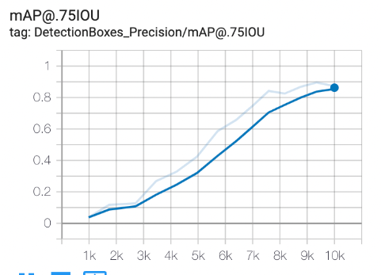

# product_detection_Anand_Gupta


# Grocery-Product-Detection
This repository builds a product detection model to recognize products from grocery shelf images. The dataset comes from [here](https://github.com/gulvarol/grocerydataset).
[ShelfImage_contain_test_train_split](https://storage.googleapis.com/open_source_datasets/ShelfImages.tar.gz)
Everything from data preparation to model training is done using [Colab Notebooks](https://colab.research.google.com/) so that no setup is required locally. All the relevant commentaries have been included inside the Colab Notebooks. 


```
├── colabcode
│   ├── Dataprepration.ipynb: EDA and data preparation notebook.
│   ├──	Evaluations.ipynb
│   ├── Inference.ipynb: Performs inference with the trained model.
│   └── Training.ipynb: Trains an SSD MobileDet model using TFOD API.
|   └── Using yolov8 model training and evaluation.ipynb:: Train an yolo model using yolov8.
├── Deliverables
│   ├── image2products.json: Contains test image names as keys and the number of products contained in each image as values.
│   └── metrics.json: mAP, precision and recall computed on test set.
├── Data
│   ├── Test.csv file 
│   ├──Train.csv file 
└── README.md
```

## Notes
* Augmentation used
	* Horizontal flips
	* Random crops
* Detection network used: SSD MobileDet and Yolo

  
  ## Results
  As we train on yolov8 over 30 epoch then the training precision will be low but On SSD the precsion is more then yolo.

  
